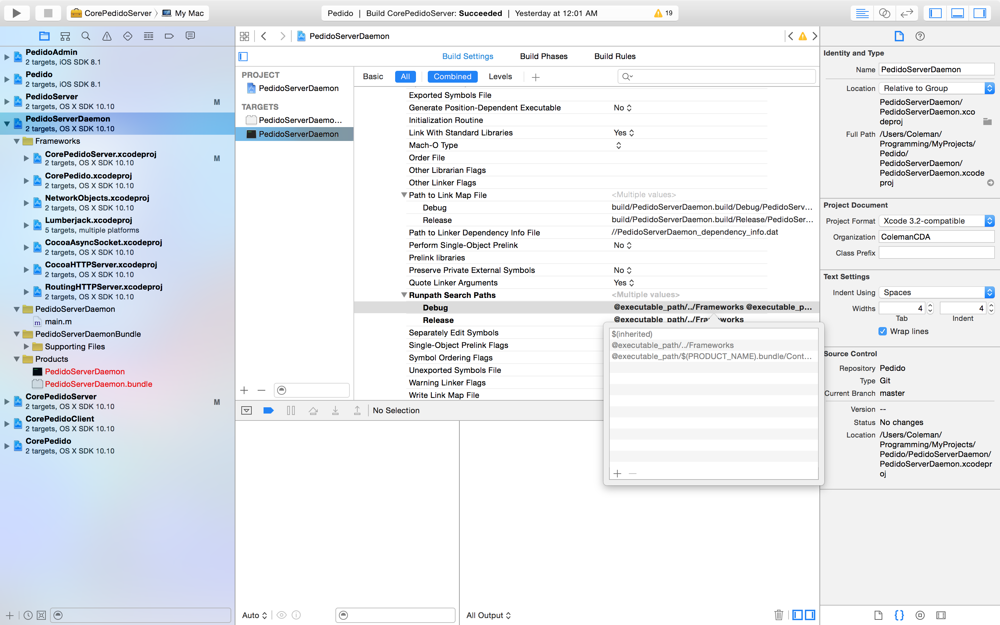
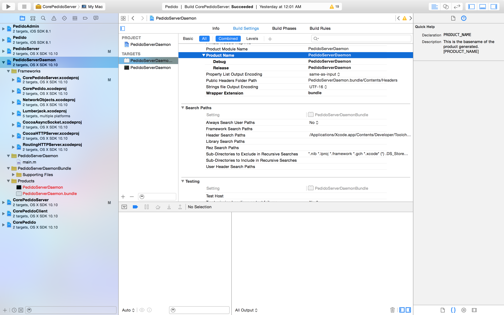
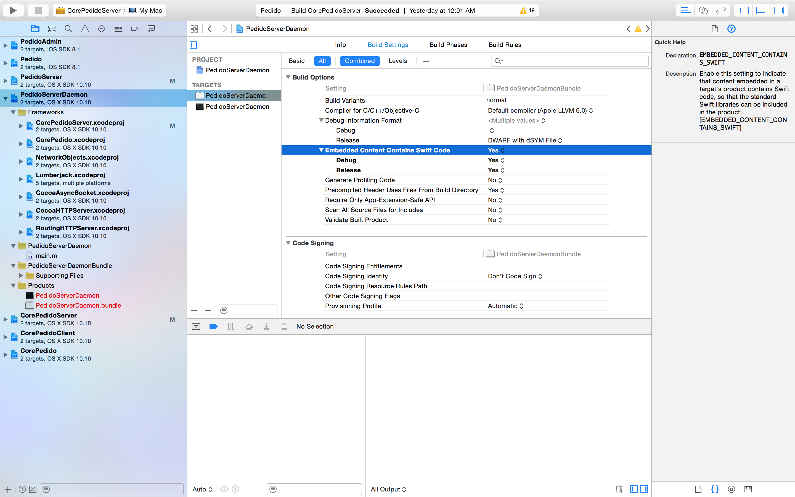
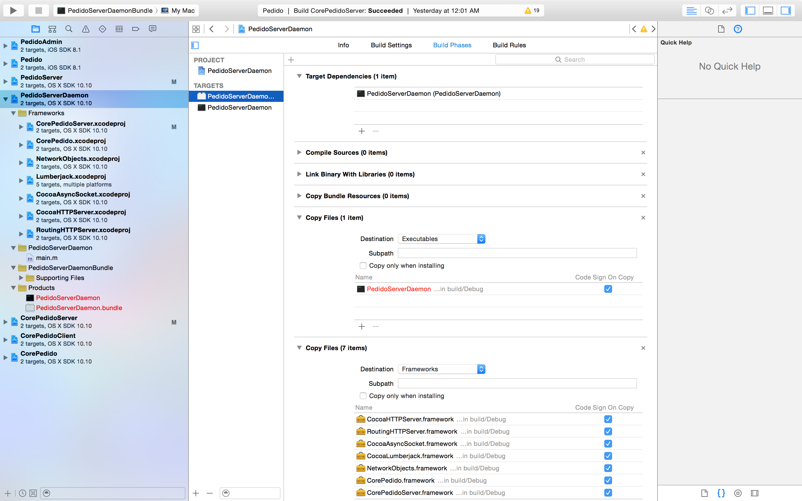
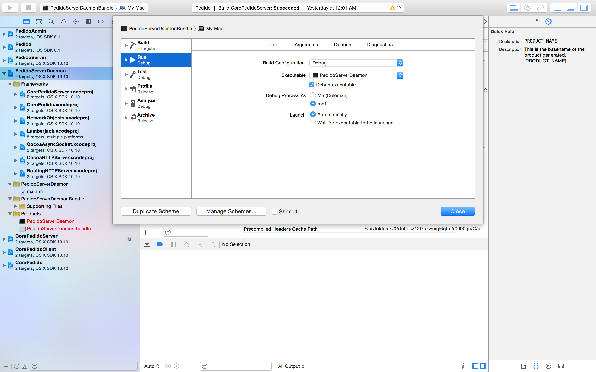

# Embedded Swift frameworks in OS X command line tools

With Swift, Apple has changed how standard libraries are shipped. With Objective-C, all of the standard libraries, system frameworks, and the runtime itself, were shipped with the OS. With Swift, Apple wanted the ability to quickly deprecate parts of the Swift Standard Library and also add new features. While these changes do break apps at the source code level (and Apple has even made migration tools for Swift 1.2), it would be a huge problem if shipped apps started to break because the standard library they are linked against has an incompatible API.

Apple's solution to the problem is to ship a specific version of the standard library with your app. While this is actually a clever solution to the problem, its brings one inconvenience: all Swift frameworks require a bundle structure to run. While this is not a problem for iOS developers, who exclusively write code to be embedded in apps (or frameworks that will be embedded in apps), for OS X developers this can be an issue (Note: [the Swift standard library being shipped with apps is another reason why you can't create static Swift libraries](https://github.com/ksm/SwiftInFlux#static-libraries)). So creating an OS X command line tool begs the question: where's my copy of the Swift Standard library?.

Well the answer is that Xcode compiles the Swift Standard Library right into your command line tool. While this may seem like a good solution, it will require you to build all of your Swift code with the command line tool. This makes linking against frameworks impossible, or does it? The solution to the issue is to mimick the app bundle structure. And what better way to do that then to create a bundle? But some steps must be followed in order to successfully link your command line tool and frameworks against the Swift Standard Library.

###1. Create an Objective-C command line tool and change the Search Paths

Not Swift. You can create a Swift framework for the code you'd put in your command line tool, but the tool itself must not compile any Swift code. Doing so will confuse the linker and make it see duplicate declarations of the Swift library (one in the shipped .dylib, another embedded in the command line tool).




- Runpath Search Paths: 

```
Debug: $(inherited) @executable_path/../Frameworks @executable_path/$(PRODUCT_NAME).bundle/Contents/Frameworks
Release: $(inherited) @executable_path/../Frameworks
```

###2. Create a bundle and change the Build Settings

Give it the same name as your command line tool, but suffixed with ```Bundle``` (e.g. `CommandLineToolProductNameBundle`). Also make sure its a target in the same project as your command line tool.



- Target Name: Command Line Tool Product Name + ```Bundle```

- Product Name: Same as Command Line Tool Product Name



- Embedded Content Contains Swift Code: ```YES```

###3. Add dependencies in Build Phases



- Target Dependencies: Your command line tool

- Create a new ```Copy files``` phase, set the ```Destination``` to ```Executables``` and add your command line tool to the list of files to copy.

- Create a new ```Copy files``` phase, set the ```Destination``` to ```Frameworks``` and add your embedded frameworks to the list of files to copy.

###4. Change the ```Run``` configuration in the bundle's scheme

You can also optionally hide the scheme of your command line tool since it cannot run standalone.



- Executable: Your command line tool

- Debug Executable: ```YES```

Now you can write your Swift code in a framework and embed it in the bundle for use in your command line tool. You can check out [PedidoServerDaemon](https://github.com/colemancda/Pedido/tree/master/PedidoServerDaemon) to see an example of this working.
